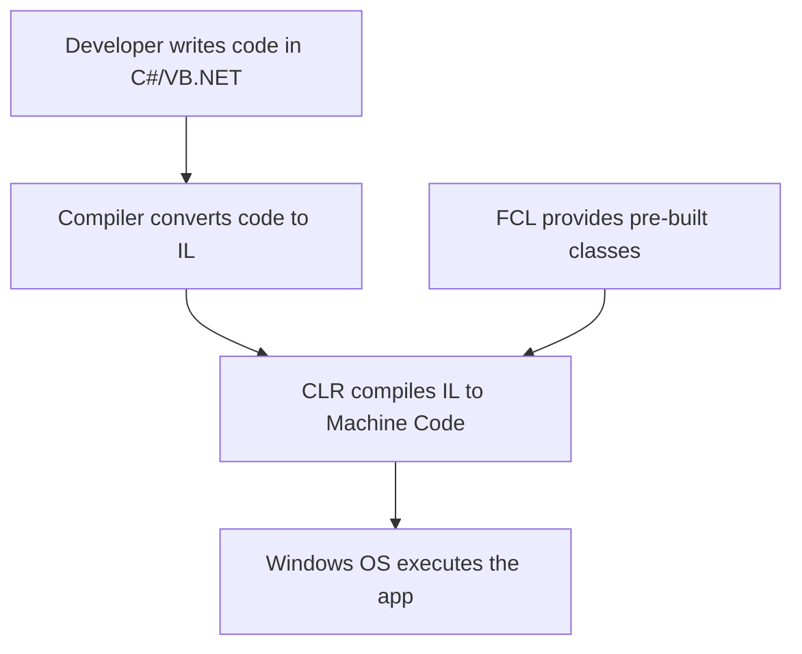
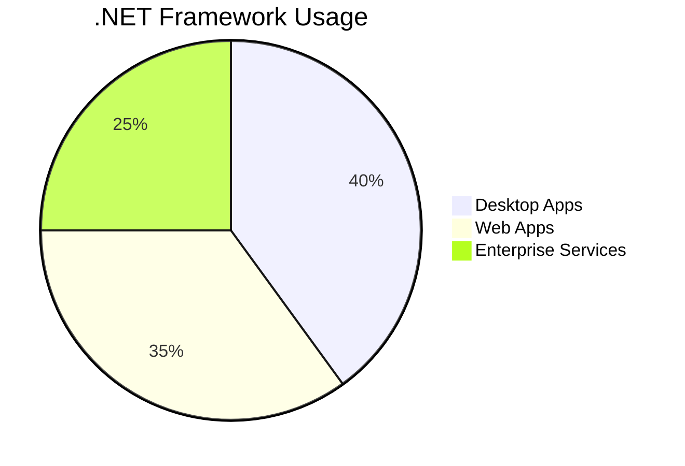
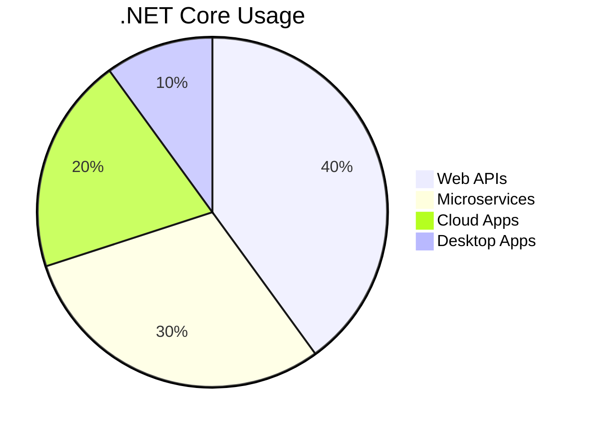

# Interview Questions and Answers

| No. | Questions |
|---- | ---------
|1 | [What is the .NET Framework?](#1-what-is-the-net-framework)|
|2 | [What is .NET Core?](#2-what-is-net-core)|
|3 | [What is TypeScript?](#what-is-typescript)|
|4 | [Write a pictorial diagram of Angular architecture?](#write-a-pictorial-diagram-of-angular-architecture)|
|5 | [What are the key components of Angular?](#what-are-the-key-components-of-angular)|
|6 | [What are directives?](#what-are-directives)|
|7 | [What are components?](#what-are-components)|
|283| [](#)


## Technical Questions

# **1. What is the .NET Framework?**

The **.NET Framework** is a **software development platform** created by Microsoft to build and run Windows applications. It provides a standardized environment with tools, libraries, and runtime services to simplify coding, manage resources (like memory), and ensure applications work securely and efficiently.

---

## **Key Components of the .NET Framework** ⚙️

### 1. **Common Language Runtime (CLR)** 🧠
- **Purpose**: The CLR is the **execution engine** that runs .NET applications. It handles tasks like memory management, security, and exception handling.
- **Example**:  
  ```csharp
  using System;
  class Program {
      static void Main() {
          // CLR compiles this code and manages its execution
          Console.WriteLine("Hello, .NET!");
      }
  }
  ```
- **Real-World Use**: Automatically frees unused memory (**garbage collection**) to prevent memory leaks.

---

### 2. **Framework Class Library (FCL)** 📚
- **Purpose**: A vast collection of **pre-built classes and methods** for common tasks like file I/O, database access, and web development.
- **Example**:  
  ```csharp
  using System.IO;
  string content = File.ReadAllText("data.txt"); // Reads a file using FCL
  ```
- **Real-World Use**: Building a login page with **ASP.NET** or connecting to a SQL database with **ADO.NET**.

---

### 3. **Languages (C#, VB.NET, F#)** 🌐
- The .NET Framework supports multiple languages. Code written in any language compiles to **Intermediate Language (IL)**, which the CLR executes.
- **Example**: A C# app can use a library written in VB.NET.

---

### 4. **ASP.NET (Web Development)** 🌍
- A framework for building **web applications and APIs**.
- **Real-World Use**:  
  ```csharp
  public class HomeController : Controller {
      public ActionResult Index() {
          return View(); // Renders a web page
      }
  }
  ```

---

### 5. **ADO.NET (Database Access)** 🔍
- Connects applications to databases (e.g., SQL Server, Oracle).
- **Example**:  
  ```csharp
  using (SqlConnection conn = new SqlConnection("ConnectionString")) {
      conn.Open();
      SqlCommand cmd = new SqlCommand("SELECT * FROM Users", conn);
      SqlDataReader reader = cmd.ExecuteReader();
  }
  ```

---

## **How the .NET Framework Works** 🔄



---

## **Real-World Use Cases** 🛠️

| **Application Type** | **Example**                          | **Technology Used**      |
|-----------------------|--------------------------------------|--------------------------|
| **Desktop Apps**      | Hospital Management System          | Windows Forms, WPF       |
| **Web Apps**          | E-commerce Platform                 | ASP.NET MVC              |
| **Web Services**      | Payment Gateway API                 | WCF (Windows Communication Foundation) |

---

## **Core Concepts Explained** 🔑

### 1. **Garbage Collection** 🗑️
- Automatically reclaims memory occupied by unused objects.
- **Analogy**: Like a "cleanup crew" that removes trash to free up space.

### 2. **Just-In-Time (JIT) Compilation** ⚡
- Converts IL code to machine code **at runtime** (not during compilation).
- **Example**: Apps like Microsoft Excel use JIT for faster startup.

### 3. **Security** 🔒
- The CLR enforces security rules (e.g., restricting file access).
- **Real-World Use**: A banking app using role-based security.

---

## **Example: Building a Simple .NET App** 🏗️

1. **Write Code**:
   ```csharp
   using System;
   class Calculator {
       static void Main() {
           Console.WriteLine("Sum: " + Add(5, 3));
       }
       static int Add(int a, int b) => a + b;
   }
   ```
2. **Compile**: Code is converted to **IL**.  
3. **Run**: CLR converts IL to machine code and executes it.  

**Output**:  
```
Sum: 8
```

---

## **.NET Framework vs. .NET Core/.NET 5+** ⚖️

| **Feature**          | **.NET Framework**                  | **.NET Core/.NET 5+**             |
|-----------------------|-------------------------------------|-----------------------------------|
| **Platform**          | Windows-only                        | Cross-platform (Windows, Linux, macOS) |
| **Performance**       | Moderate                            | Faster (optimized for cloud)      |
| **Use Case**          | Legacy Windows apps                 | Modern, cloud-native apps         |

---

## **Why Learn .NET Framework Today?** 🎯
1. **Maintain Legacy Systems**: Many enterprises still rely on .NET Framework apps.
2. **Foundational Knowledge**: Core concepts (CLR, FCL) apply to modern .NET versions.
3. **Career Opportunities**: Legacy systems need maintenance and upgrades.

---

# **Summary** 📝



- **.NET Framework** is a **Windows-based platform** for building desktop, web, and service apps.
- **CLR** manages code execution, memory, and security.
- **FCL** provides reusable code for common tasks.
- Still relevant for maintaining legacy systems and understanding core .NET principles.

---

# **2. What is .NET Core?** 🚀

**.NET Core** is a **free, open-source, cross-platform** framework developed by Microsoft for building modern, cloud-based, and high-performance applications. It’s designed to run on **Windows, Linux, and macOS**, making it ideal for diverse environments like web apps, microservices, APIs, and IoT solutions.

---

## **Key Features of .NET Core** 🔑

| **Feature**          | **Description**                                                                 | **Example**                                                                 |
|-----------------------|---------------------------------------------------------------------------------|-----------------------------------------------------------------------------|
| **Cross-Platform**    | Runs on Windows, Linux, and macOS.                                              | Deploy a web API on a Linux server in Azure.                                |
| **Open-Source**       | Source code is publicly available on GitHub.                                    | Contribute to the .NET Core runtime on GitHub.                              |
| **High Performance**  | Optimized for speed and scalability.                                            | Handle 1 million requests per second with Kestrel web server.               |
| **Modular Design**    | Install only the components you need via NuGet packages.                        | Use `Microsoft.EntityFrameworkCore.SqlServer` for database access.          |
| **Cloud-Ready**       | Built for Docker containers and cloud platforms (Azure, AWS).                   | Deploy a microservice to AWS Lambda.                                        |
| **Unified Platform**  | Merged into **.NET 5+** (now called ".NET"), combining .NET Core and .NET Framework. | Migrate a .NET Framework app to .NET 6.                                     |

---

## **.NET Core Architecture** 🏗️

```mermaid
flowchart TD
    A[Application Code (C#/F#/VB)] --> B[.NET Core SDK]
    B --> C[Compiled to IL (Intermediate Language)]
    C --> D[.NET Core Runtime (CLR)]
    D --> E[Platform-Specific Machine Code]
    E --> F[Run on Windows/Linux/macOS]
    G[ASP.NET Core] --> A
    H[Entity Framework Core] --> A
    I[NuGet Packages] --> A
```

---

## **How .NET Core Works** 🔄

1. **Write Code** in C#, F#, or VB.NET.
2. **Compile** to **Intermediate Language (IL)**.
3. **CLR (CoreCLR)** compiles IL to **machine code** using JIT (Just-In-Time) compilation.
4. **Execute** the app on any supported OS.

---

## **.NET Core vs. .NET Framework** ⚖️

| **Aspect**            | **.NET Core**                                     | **.NET Framework**                         |
|-----------------------|---------------------------------------------------|--------------------------------------------|
| **Platform Support**  | Windows, Linux, macOS                             | Windows-only                               |
| **Open-Source**       | Yes                                               | No (mostly closed-source)                  |
| **Performance**       | Faster, optimized for cloud                       | Moderate                                   |
| **Deployment**        | Self-contained or framework-dependent             | Requires full framework installation       |
| **Use Cases**         | Microservices, cloud apps, cross-platform apps    | Legacy Windows desktop/web apps            |

---

## **Real-World Use Cases** 🌍

### 1. **Web APIs with ASP.NET Core** 🌐
   ```csharp
   // ASP.NET Core Web API Example
   [ApiController]
   [Route("api/[controller]")]
   public class ProductsController : ControllerBase {
       [HttpGet]
       public IActionResult GetProducts() {
           return Ok(new[] { "Laptop", "Phone", "Tablet" });
       }
   }
   ```
   - **Use Case**: Build a REST API for a mobile app backend.

### 2. **Microservices** �
   - Deploy lightweight services in Docker containers.
   - **Example**: A payment processing service in an e-commerce platform.

### 3. **Cross-Platform Apps** 💻
   - **Use Case**: Create a console app that runs on both Windows and Linux:
     ```csharp
     Console.WriteLine($"Hello from {Environment.OSVersion}!");
     ```

### 4. **Cloud-Native Apps** ☁️
   - **Example**: A serverless function in Azure Functions:
     ```csharp
     public static HttpResponseMessage Run(HttpRequestMessage req) {
         return new HttpResponseMessage(HttpStatusCode.OK) {
             Content = new StringContent("Hello from Azure!")
         };
     }
     ```

---

## **Core Components of .NET Core** 🧩

1. **CoreCLR**: The .NET Core runtime (like CLR in .NET Framework).
2. **CoreFX**: Base Class Library (BCL) for .NET Core.
3. **ASP.NET Core**: Framework for web apps and APIs.
4. **Entity Framework Core**: ORM for database interactions.
5. **C#/F#/VB.NET**: Supported programming languages.

---

## **Why Use .NET Core?** 🎯

1. **Scalability**: Handle high traffic with minimal resources.
2. **Flexibility**: Choose only the NuGet packages you need.
3. **Modern Tooling**: Use CLI tools, Visual Studio, or VS Code.
4. **Future-Proof**: Part of the unified ".NET 5+" platform.

---

# **Summary** 📝



- **.NET Core** is a **cross-platform**, **open-source** framework for modern apps.
- **Key Features**: Modular, high-performance, and cloud-ready.
- **Use Cases**: Web APIs, microservices, cloud-native apps, and cross-platform solutions.
- **Evolution**: Now part of **.NET 5+**, unifying .NET Core and .NET Framework.

---

**Need more examples or a deeper dive into a specific topic? Let me know!** 😊


