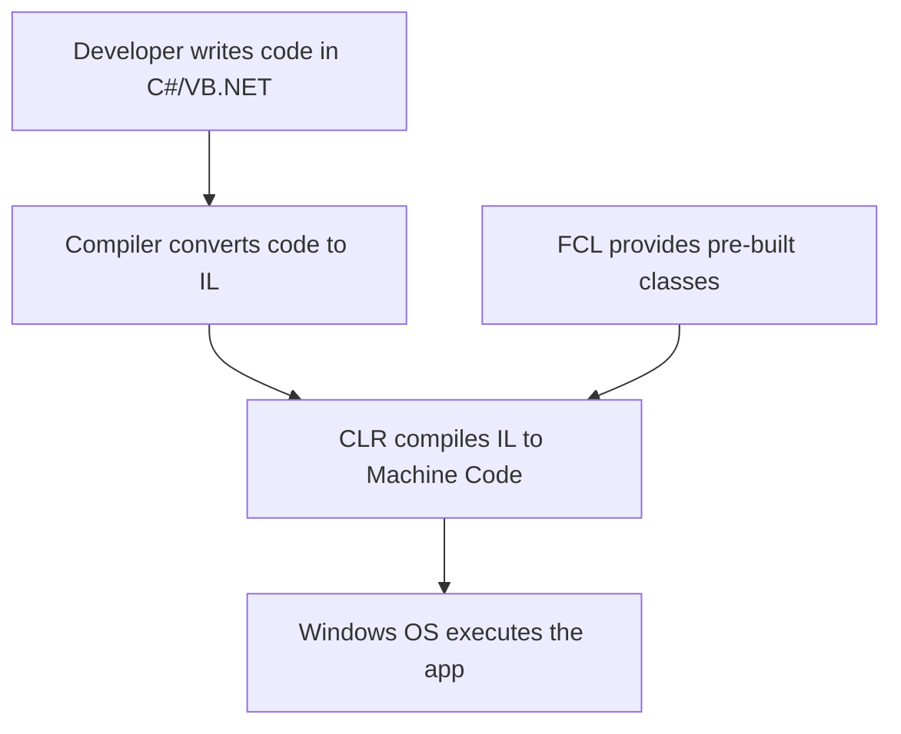
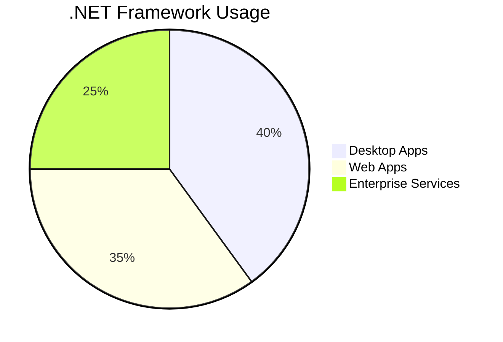

# Interview Questions and Answers

| No. | Questions |
|---- | ---------
|1 | [What is the .NET Framework](#What-is-the-.NET-Framework)|
|2 | [What is the difference between AngularJS and Angular?](#what-is-the-difference-between-angularjs-and-angular)|
|3 | [What is TypeScript?](#what-is-typescript)|
|4 | [Write a pictorial diagram of Angular architecture?](#write-a-pictorial-diagram-of-angular-architecture)|
|5 | [What are the key components of Angular?](#what-are-the-key-components-of-angular)|
|6 | [What are directives?](#what-are-directives)|
|7 | [What are components?](#what-are-components)|
|283| [](#)


## Technical Questions

# **What is the .NET Framework?** 🧩

The **.NET Framework** is a **software development platform** created by Microsoft to build and run Windows applications. It provides a standardized environment with tools, libraries, and runtime services to simplify coding, manage resources (like memory), and ensure applications work securely and efficiently.

---

## **Key Components of the .NET Framework** ⚙️

### 1. **Common Language Runtime (CLR)** 🧠
- **Purpose**: The CLR is the **execution engine** that runs .NET applications. It handles tasks like memory management, security, and exception handling.
- **Example**:  
  ```csharp
  using System;
  class Program {
      static void Main() {
          // CLR compiles this code and manages its execution
          Console.WriteLine("Hello, .NET!");
      }
  }
  ```
- **Real-World Use**: Automatically frees unused memory (**garbage collection**) to prevent memory leaks.

---

### 2. **Framework Class Library (FCL)** 📚
- **Purpose**: A vast collection of **pre-built classes and methods** for common tasks like file I/O, database access, and web development.
- **Example**:  
  ```csharp
  using System.IO;
  string content = File.ReadAllText("data.txt"); // Reads a file using FCL
  ```
- **Real-World Use**: Building a login page with **ASP.NET** or connecting to a SQL database with **ADO.NET**.

---

### 3. **Languages (C#, VB.NET, F#)** 🌐
- The .NET Framework supports multiple languages. Code written in any language compiles to **Intermediate Language (IL)**, which the CLR executes.
- **Example**: A C# app can use a library written in VB.NET.

---

### 4. **ASP.NET (Web Development)** 🌍
- A framework for building **web applications and APIs**.
- **Real-World Use**:  
  ```csharp
  public class HomeController : Controller {
      public ActionResult Index() {
          return View(); // Renders a web page
      }
  }
  ```

---

### 5. **ADO.NET (Database Access)** 🔍
- Connects applications to databases (e.g., SQL Server, Oracle).
- **Example**:  
  ```csharp
  using (SqlConnection conn = new SqlConnection("ConnectionString")) {
      conn.Open();
      SqlCommand cmd = new SqlCommand("SELECT * FROM Users", conn);
      SqlDataReader reader = cmd.ExecuteReader();
  }
  ```

---

## **How the .NET Framework Works** 🔄



---

## **Real-World Use Cases** 🛠️

| **Application Type** | **Example**                          | **Technology Used**      |
|-----------------------|--------------------------------------|--------------------------|
| **Desktop Apps**      | Hospital Management System          | Windows Forms, WPF       |
| **Web Apps**          | E-commerce Platform                 | ASP.NET MVC              |
| **Web Services**      | Payment Gateway API                 | WCF (Windows Communication Foundation) |

---

## **Core Concepts Explained** 🔑

### 1. **Garbage Collection** 🗑️
- Automatically reclaims memory occupied by unused objects.
- **Analogy**: Like a "cleanup crew" that removes trash to free up space.

### 2. **Just-In-Time (JIT) Compilation** ⚡
- Converts IL code to machine code **at runtime** (not during compilation).
- **Example**: Apps like Microsoft Excel use JIT for faster startup.

### 3. **Security** 🔒
- The CLR enforces security rules (e.g., restricting file access).
- **Real-World Use**: A banking app using role-based security.

---

## **Example: Building a Simple .NET App** 🏗️

1. **Write Code**:
   ```csharp
   using System;
   class Calculator {
       static void Main() {
           Console.WriteLine("Sum: " + Add(5, 3));
       }
       static int Add(int a, int b) => a + b;
   }
   ```
2. **Compile**: Code is converted to **IL**.  
3. **Run**: CLR converts IL to machine code and executes it.  

**Output**:  
```
Sum: 8
```

---

## **.NET Framework vs. .NET Core/.NET 5+** ⚖️

| **Feature**          | **.NET Framework**                  | **.NET Core/.NET 5+**             |
|-----------------------|-------------------------------------|-----------------------------------|
| **Platform**          | Windows-only                        | Cross-platform (Windows, Linux, macOS) |
| **Performance**       | Moderate                            | Faster (optimized for cloud)      |
| **Use Case**          | Legacy Windows apps                 | Modern, cloud-native apps         |

---

## **Why Learn .NET Framework Today?** 🎯
1. **Maintain Legacy Systems**: Many enterprises still rely on .NET Framework apps.
2. **Foundational Knowledge**: Core concepts (CLR, FCL) apply to modern .NET versions.
3. **Career Opportunities**: Legacy systems need maintenance and upgrades.

---

# **Summary** 📝



- **.NET Framework** is a **Windows-based platform** for building desktop, web, and service apps.
- **CLR** manages code execution, memory, and security.
- **FCL** provides reusable code for common tasks.
- Still relevant for maintaining legacy systems and understanding core .NET principles.

---


### Explanation

- **Initialization**: Here, `a` and `b` are initialized before passing to the `Swap` method.
- **Passing by Reference**: The `ref` keyword is used in both the method call `Swap(ref a, ref b)` and in the method definition `static void Swap(ref int x, ref int y)`.
- **Direct Modification**: The `Swap` method directly modifies the original values of `a` and `b`.

With `ref`, you get efficiency and flexibility, especially in cases where you need to modify multiple variables or large objects in a method.

Feel free to ask more questions or for further explanations on different topics!

