# Interview Questions and Answers

### Table of Contents
| No. | Questions |
|---- | ---------
|1 | [What is the .NET Framework?](#1-what-is-the-net-framework)|
|2 | [What is .NET Core?](#2-what-is-net-core)|
|3 | [What is .NET Standard?](#3-what-is-net-standard)|
|4 | [Key Benefits of .NET Core vs. .NET Framework](#4-key-benefits-of-net-core-vs-net-framework)|
|5 | [Dependency Injection (DI) in .NET Core](#5-dependency-injection-di-in-net-core)|
|6 | [Memory Management in .NET Core](#6-memory-management-in-net-core)|
|6 | [What is Kestrel, and Why is it Used in .NET Core?](#7-what-is-kestrel-and-why-is-it-used-in-net-core)|


## Technical Questions

# **1. What is the .NET Framework?**

The **.NET Framework** is a **software development platform** created by Microsoft to build and run Windows applications. It provides a standardized environment with tools, libraries, and runtime services to simplify coding, manage resources (like memory), and ensure applications work securely and efficiently.

---

## **Key Components of the .NET Framework** ⚙️

### 1. **Common Language Runtime (CLR)** 🧠
- **Purpose**: The CLR is the **execution engine** that runs .NET applications. It handles tasks like memory management, security, and exception handling.
- **Example**:  
  ```csharp
  using System;
  class Program {
      static void Main() {
          // CLR compiles this code and manages its execution
          Console.WriteLine("Hello, .NET!");
      }
  }
  ```
- **Real-World Use**: Automatically frees unused memory (**garbage collection**) to prevent memory leaks.

---

### 2. **Framework Class Library (FCL)** 📚
- **Purpose**: A vast collection of **pre-built classes and methods** for common tasks like file I/O, database access, and web development.
- **Example**:  
  ```csharp
  using System.IO;
  string content = File.ReadAllText("data.txt"); // Reads a file using FCL
  ```
- **Real-World Use**: Building a login page with **ASP.NET** or connecting to a SQL database with **ADO.NET**.

---

### 3. **Languages (C#, VB.NET, F#)** 🌐
- The .NET Framework supports multiple languages. Code written in any language compiles to **Intermediate Language (IL)**, which the CLR executes.
- **Example**: A C# app can use a library written in VB.NET.

---

### 4. **ASP.NET (Web Development)** 🌍
- A framework for building **web applications and APIs**.
- **Real-World Use**:  
  ```csharp
  public class HomeController : Controller {
      public ActionResult Index() {
          return View(); // Renders a web page
      }
  }
  ```

---

### 5. **ADO.NET (Database Access)** 🔍
- Connects applications to databases (e.g., SQL Server, Oracle).
- **Example**:  
  ```csharp
  using (SqlConnection conn = new SqlConnection("ConnectionString")) {
      conn.Open();
      SqlCommand cmd = new SqlCommand("SELECT * FROM Users", conn);
      SqlDataReader reader = cmd.ExecuteReader();
  }
  ```

---

## **How the .NET Framework Works** 🔄

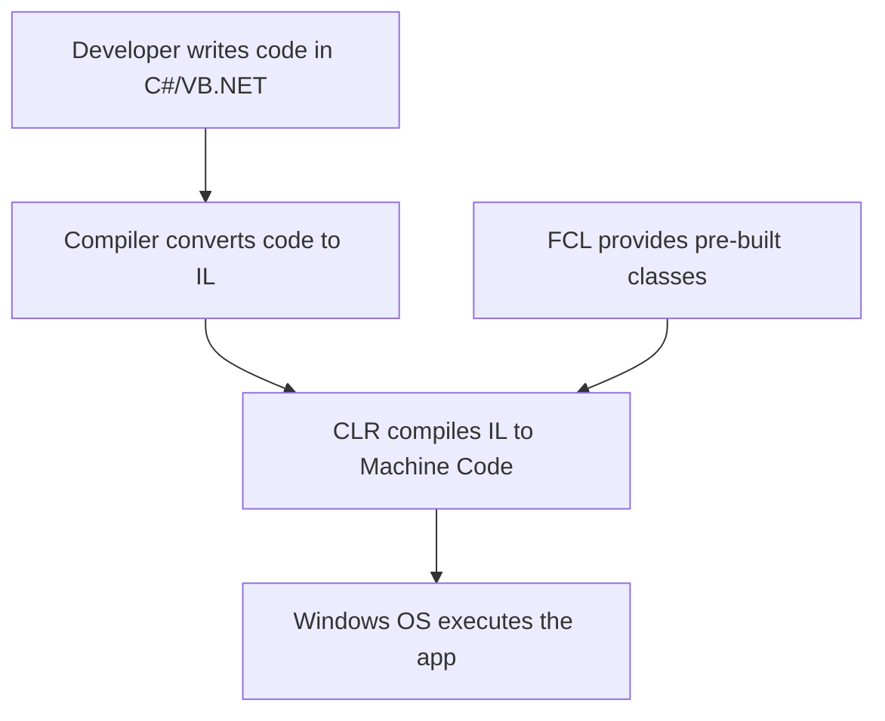

---

## **Real-World Use Cases** 🛠️

| **Application Type** | **Example**                          | **Technology Used**      |
|-----------------------|--------------------------------------|--------------------------|
| **Desktop Apps**      | Hospital Management System          | Windows Forms, WPF       |
| **Web Apps**          | E-commerce Platform                 | ASP.NET MVC              |
| **Web Services**      | Payment Gateway API                 | WCF (Windows Communication Foundation) |

---

## **Core Concepts Explained** 🔑

### 1. **Garbage Collection** 🗑️
- Automatically reclaims memory occupied by unused objects.
- **Analogy**: Like a "cleanup crew" that removes trash to free up space.

### 2. **Just-In-Time (JIT) Compilation** ⚡
- Converts IL code to machine code **at runtime** (not during compilation).
- **Example**: Apps like Microsoft Excel use JIT for faster startup.

### 3. **Security** 🔒
- The CLR enforces security rules (e.g., restricting file access).
- **Real-World Use**: A banking app using role-based security.

---

## **Example: Building a Simple .NET App** 🏗️

1. **Write Code**:
   ```csharp
   using System;
   class Calculator {
       static void Main() {
           Console.WriteLine("Sum: " + Add(5, 3));
       }
       static int Add(int a, int b) => a + b;
   }
   ```
2. **Compile**: Code is converted to **IL**.  
3. **Run**: CLR converts IL to machine code and executes it.  

**Output**:  
```
Sum: 8
```

---

## **.NET Framework vs. .NET Core/.NET 5+** ⚖️

| **Feature**          | **.NET Framework**                  | **.NET Core/.NET 5+**             |
|-----------------------|-------------------------------------|-----------------------------------|
| **Platform**          | Windows-only                        | Cross-platform (Windows, Linux, macOS) |
| **Performance**       | Moderate                            | Faster (optimized for cloud)      |
| **Use Case**          | Legacy Windows apps                 | Modern, cloud-native apps         |

---

## **Why Learn .NET Framework Today?** 🎯
1. **Maintain Legacy Systems**: Many enterprises still rely on .NET Framework apps.
2. **Foundational Knowledge**: Core concepts (CLR, FCL) apply to modern .NET versions.
3. **Career Opportunities**: Legacy systems need maintenance and upgrades.

---

# **Summary** 📝

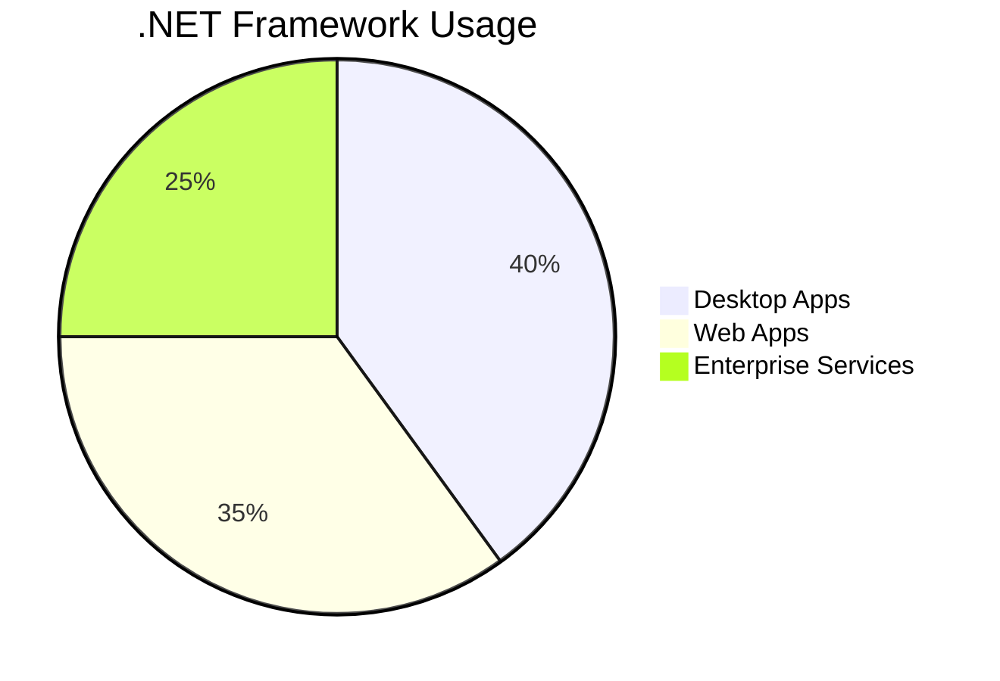

- **.NET Framework** is a **Windows-based platform** for building desktop, web, and service apps.
- **CLR** manages code execution, memory, and security.
- **FCL** provides reusable code for common tasks.
- Still relevant for maintaining legacy systems and understanding core .NET principles.

---
 **[⬆ Back to Top](#table-of-contents)**
 
# **2. What is .NET Core?**

**.NET Core** is a **free, open-source, cross-platform** framework developed by Microsoft for building modern, cloud-based, and high-performance applications. It’s designed to run on **Windows, Linux, and macOS**, making it ideal for diverse environments like web apps, microservices, APIs, and IoT solutions.

---

## **Key Features of .NET Core** 🔑

| **Feature**          | **Description**                                                                 | **Example**                                                                 |
|-----------------------|---------------------------------------------------------------------------------|-----------------------------------------------------------------------------|
| **Cross-Platform**    | Runs on Windows, Linux, and macOS.                                              | Deploy a web API on a Linux server in Azure.                                |
| **Open-Source**       | Source code is publicly available on GitHub.                                    | Contribute to the .NET Core runtime on GitHub.                              |
| **High Performance**  | Optimized for speed and scalability.                                            | Handle 1 million requests per second with Kestrel web server.               |
| **Modular Design**    | Install only the components you need via NuGet packages.                        | Use `Microsoft.EntityFrameworkCore.SqlServer` for database access.          |
| **Cloud-Ready**       | Built for Docker containers and cloud platforms (Azure, AWS).                   | Deploy a microservice to AWS Lambda.                                        |
| **Unified Platform**  | Merged into **.NET 5+** (now called ".NET"), combining .NET Core and .NET Framework. | Migrate a .NET Framework app to .NET 6.                                     |

---

## **.NET Core Architecture** 🏗️

```mermaid
flowchart TD
    A[Application Code (C#/F#/VB)] --> B[.NET Core SDK]
    B --> C[Compiled to IL (Intermediate Language)]
    C --> D[.NET Core Runtime (CLR)]
    D --> E[Platform-Specific Machine Code]
    E --> F[Run on Windows/Linux/macOS]
    G[ASP.NET Core] --> A
    H[Entity Framework Core] --> A
    I[NuGet Packages] --> A
```

---

## **How .NET Core Works** 🔄

1. **Write Code** in C#, F#, or VB.NET.
2. **Compile** to **Intermediate Language (IL)**.
3. **CLR (CoreCLR)** compiles IL to **machine code** using JIT (Just-In-Time) compilation.
4. **Execute** the app on any supported OS.

---

## **.NET Core vs. .NET Framework** ⚖️

| **Aspect**            | **.NET Core**                                     | **.NET Framework**                         |
|-----------------------|---------------------------------------------------|--------------------------------------------|
| **Platform Support**  | Windows, Linux, macOS                             | Windows-only                               |
| **Open-Source**       | Yes                                               | No (mostly closed-source)                  |
| **Performance**       | Faster, optimized for cloud                       | Moderate                                   |
| **Deployment**        | Self-contained or framework-dependent             | Requires full framework installation       |
| **Use Cases**         | Microservices, cloud apps, cross-platform apps    | Legacy Windows desktop/web apps            |

---

## **Real-World Use Cases** 🌍

### 1. **Web APIs with ASP.NET Core** 🌐
   ```csharp
   // ASP.NET Core Web API Example
   [ApiController]
   [Route("api/[controller]")]
   public class ProductsController : ControllerBase {
       [HttpGet]
       public IActionResult GetProducts() {
           return Ok(new[] { "Laptop", "Phone", "Tablet" });
       }
   }
   ```
   - **Use Case**: Build a REST API for a mobile app backend.

### 2. **Microservices** �
   - Deploy lightweight services in Docker containers.
   - **Example**: A payment processing service in an e-commerce platform.

### 3. **Cross-Platform Apps** 💻
   - **Use Case**: Create a console app that runs on both Windows and Linux:
     ```csharp
     Console.WriteLine($"Hello from {Environment.OSVersion}!");
     ```

### 4. **Cloud-Native Apps** ☁️
   - **Example**: A serverless function in Azure Functions:
     ```csharp
     public static HttpResponseMessage Run(HttpRequestMessage req) {
         return new HttpResponseMessage(HttpStatusCode.OK) {
             Content = new StringContent("Hello from Azure!")
         };
     }
     ```

---

## **Core Components of .NET Core** 🧩

1. **CoreCLR**: The .NET Core runtime (like CLR in .NET Framework).
2. **CoreFX**: Base Class Library (BCL) for .NET Core.
3. **ASP.NET Core**: Framework for web apps and APIs.
4. **Entity Framework Core**: ORM for database interactions.
5. **C#/F#/VB.NET**: Supported programming languages.

---

## **Why Use .NET Core?** 🎯

1. **Scalability**: Handle high traffic with minimal resources.
2. **Flexibility**: Choose only the NuGet packages you need.
3. **Modern Tooling**: Use CLI tools, Visual Studio, or VS Code.
4. **Future-Proof**: Part of the unified ".NET 5+" platform.

---

# **Summary** 📝

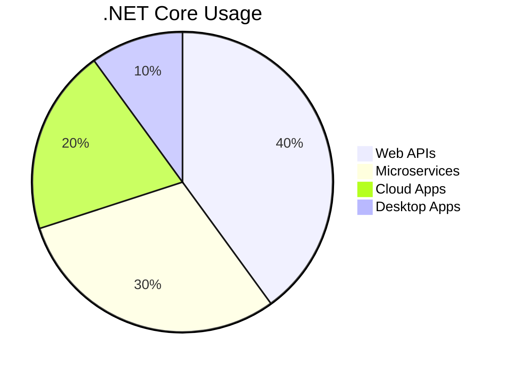

- **.NET Core** is a **cross-platform**, **open-source** framework for modern apps.
- **Key Features**: Modular, high-performance, and cloud-ready.
- **Use Cases**: Web APIs, microservices, cloud-native apps, and cross-platform solutions.
- **Evolution**: Now part of **.NET 5+**, unifying .NET Core and .NET Framework.

---
 **[⬆ Back to Top](#table-of-contents)**
 
# **3. What is .NET Standard?**

**.NET Standard** is a **specification** (a set of APIs) that defines a **common set of rules** for .NET platforms like .NET Framework, .NET Core, Xamarin, and Unity. It ensures that code written for one platform can **run on any other platform** that supports the same .NET Standard version. Think of it as a **"universal language"** that all .NET platforms understand.

---

## **Why Do We Need .NET Standard?** 🤔

Imagine you build a library (e.g., a math calculator) in **.NET Core** but later want to use it in a **Xamarin mobile app** or a **legacy .NET Framework app**. Without .NET Standard, you’d need to rewrite the code for each platform. **.NET Standard solves this problem** by providing a **common API surface** that all platforms agree to support.

---

## **Key Features of .NET Standard** 🔑

| **Feature**               | **Description**                                                                 | **Example**                                                                 |
|---------------------------|---------------------------------------------------------------------------------|-----------------------------------------------------------------------------|
| **Cross-Platform Support**| Share code between .NET Framework, .NET Core, Xamarin, Unity, etc.              | A utility library used in a .NET Core API and a Xamarin app.                |
| **Versioned Compatibility**| Higher versions add more APIs but require newer platform versions.              | .NET Standard 2.0 works with .NET Framework 4.6.1 and .NET Core 2.0.       |
| **Simplified Maintenance**| Maintain one codebase instead of multiple platform-specific versions.           | Fix a bug once, and all platforms benefit.                                  |

---

## **How .NET Standard Works** 🔄

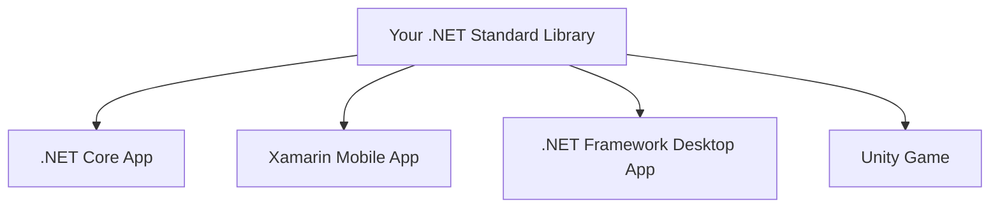

---

## **.NET Standard vs. .NET Core vs. .NET Framework** ⚖️

| **Aspect**            | **.NET Standard**                               | **.NET Core**                                 | **.NET Framework**                     |
|-----------------------|-------------------------------------------------|-----------------------------------------------|----------------------------------------|
| **Purpose**           | Defines APIs for cross-platform compatibility.  | Modern, cross-platform runtime for apps.      | Legacy Windows-only runtime.           |
| **Platform Support**  | All .NET platforms (specification, not runtime).| Windows, Linux, macOS.                        | Windows-only.                          |
| **Deployment**        | Used to build reusable libraries.               | Used to build apps/services.                  | Used to build Windows apps.            |

---

## **.NET Standard Version Compatibility** 🔗

| **.NET Standard** | **.NET Framework** | **.NET Core** | **Xamarin**      |
|-------------------|--------------------|---------------|------------------|
| 1.0               | 4.5                | 1.0           | 6.0              |
| 1.3               | 4.6                | 1.0           | 6.0              |
| **2.0**           | **4.6.1**          | **2.0**       | **8.0**          |
| 2.1               | ❌ Not Supported    | 3.0           | 10.0             |

---

## **Real-World Use Cases** 🌍

### 1. **Shared Utility Libraries** 🛠️
   - **Example**: A logging library used in a .NET Core API, a Xamarin app, and a Unity game.
   ```csharp
   // .NET Standard Library (MathUtils.cs)
   public static class MathUtils {
       public static int Add(int a, int b) => a + b;
   }
   ```

### 2. **Cross-Platform Business Logic** 📱
   - **Use Case**: Reuse payment processing logic in a web app (.NET Core) and mobile app (Xamarin).

### 3. **Legacy System Integration** 🖥️
   - **Example**: Share data validation rules between a .NET Framework desktop app and a modern .NET 6 microservice.

---

## **Example: Creating a .NET Standard Library** 🏗️

1. **Create a .NET Standard Class Library**:
   ```csharp
   // StringHelper.cs
   namespace SharedLibrary {
       public static class StringHelper {
           public static string Reverse(string input) {
               char[] chars = input.ToCharArray();
               Array.Reverse(chars);
               return new string(chars);
           }
       }
   }
   ```

2. **Use the Library in a .NET Core App**:
   ```csharp
   // .NET Core Program.cs
   using SharedLibrary;
   Console.WriteLine(StringHelper.Reverse("Hello")); // Output: "olleH"
   ```

3. **Use the Library in a Xamarin App**:
   ```csharp
   // Xamarin Button Click Event
   label.Text = StringHelper.Reverse(entry.Text);
   ```

---

## **When to Use .NET Standard?** 🎯

1. **Code Sharing**: Build libraries used across multiple platforms.
2. **Legacy + Modern Mix**: Maintain compatibility between old and new systems.
3. **Future-Proofing**: Prepare for migration to .NET 5/6/7+.

---

## **.NET Standard and .NET 5+** 🔄

- **.NET 5+** (now called ".NET") unifies .NET Core, .NET Framework, and Xamarin.
- **.NET Standard** is still relevant for:
  - Libraries targeting older platforms (e.g., .NET Framework 4.x).
  - Projects not yet migrated to .NET 5+.

---

# **Summary** 📝

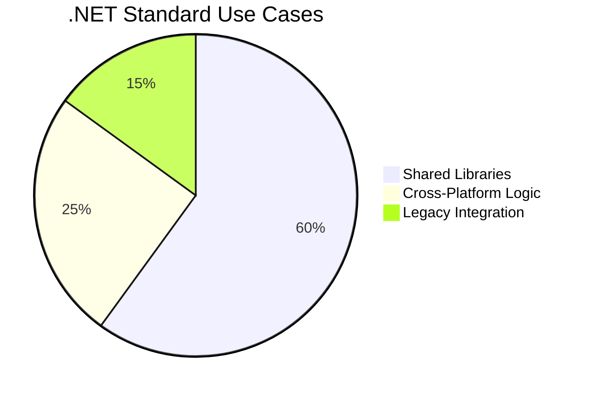

- **.NET Standard** is a **specification** that ensures code compatibility across .NET platforms.
- **Key Benefit**: Write once, run anywhere (e.g., .NET Core, Xamarin, .NET Framework).
- **Versioning**: Higher versions offer more APIs but require newer platforms.
- **Future**: While .NET 5+ reduces the need for .NET Standard, it remains crucial for legacy systems.

---
---

# **4. Key Benefits of .NET Core vs. .NET Framework** 

## **1. Cross-Platform Support** 🌍  
**.NET Core** runs on **Windows, Linux, and macOS**, while .NET Framework is **Windows-only**.  
- **Example**: Deploy a web API on a Linux server in AWS or Azure.  
- **Real-World Use**: A startup uses .NET Core to build a SaaS app that runs on cost-effective Linux servers.  

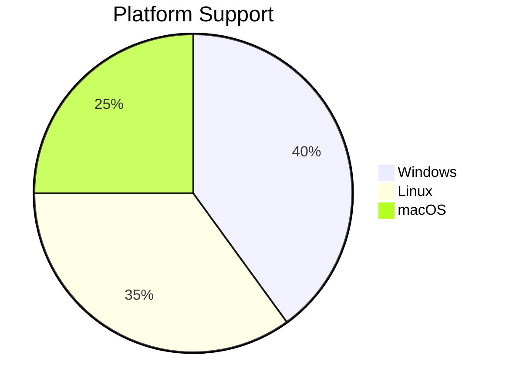

---

## **2. High Performance** ⚡  
.NET Core is optimized for speed and scalability.  
- **Kestrel Web Server**: Handles 1M+ requests/sec vs. IIS in .NET Framework.  
- **Benchmark Example**:  
  ```csharp
  // .NET Core: Async/await optimizations
  public async Task<string> GetDataAsync() {
      return await _httpClient.GetStringAsync("https://api.example.com");
  }
  ```

---

## **3. Open-Source & Community-Driven** 🔓  
- **Transparency**: Code is publicly available on [GitHub](https://github.com/dotnet/core).  
- **Community Contributions**: Developers worldwide fix bugs and add features.  

---

## **4. Modular Design via NuGet** 🧩  
Install **only the packages you need**, reducing app size.  
- **Example**:  
  ```xml
  <!-- Include only EF Core and SQL Server -->
  <PackageReference Include="Microsoft.EntityFrameworkCore.SqlServer" Version="6.0.0" />
  ```
- **.NET Framework**: Requires installing the **entire framework**, even for small apps.

---

## **5. Cloud-Native & Container-Friendly** ☁️  
Built for **Docker, Kubernetes, and serverless** (e.g., AWS Lambda, Azure Functions).  
- **Example**:  
  ```Dockerfile
  FROM mcr.microsoft.com/dotnet/sdk:6.0 AS build
  WORKDIR /app
  COPY . ./
  RUN dotnet publish -c Release -o out
  ```
- **Real-World Use**: A fintech company deploys microservices in Docker containers on Kubernetes.

---

## **6. Unified Platform (.NET 5+)** 🔄  
.NET Core evolved into **.NET 5/6/7/8**, merging .NET Framework, Xamarin, and .NET Core.  
- **Migration Example**: A legacy .NET Framework app is upgraded to .NET 6 for cross-platform support.  

---

## **7. Flexible Deployment Models** 📦  
- **Self-Contained**: Bundle the runtime with your app.  
- **Framework-Dependent**: Rely on a pre-installed runtime.  

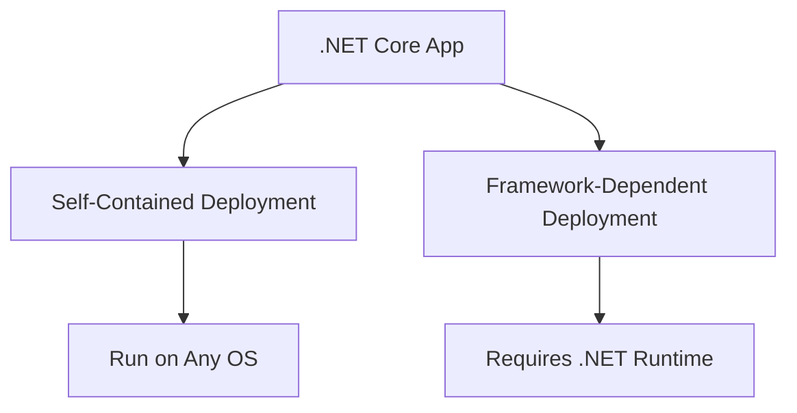

---

## **8. Side-by-Side Versioning** 🔄  
Run multiple .NET Core versions on the same machine.  
- **Example**: Host a .NET Core 3.1 app and a .NET 7 app on the same server.  

---

## **9. Microservices & Scalability** 🧑💻  
- **Lightweight**: Build small, focused services.  
- **Real-World Use**: An e-commerce platform uses .NET Core microservices for cart, payment, and inventory.  

---

## **10. Modern Tooling** 🛠️  
- **CLI Tools**: Build, test, and deploy from the command line.  
- **Visual Studio Code**: Free, lightweight editor with C# extensions.  

---

# **.NET Core vs. .NET Framework: Comparison Table** ⚖️

| **Feature**            | **.NET Core**                                     | **.NET Framework**                     |
|-------------------------|---------------------------------------------------|----------------------------------------|
| **Platform Support**    | Windows, Linux, macOS                             | Windows-only                           |
| **Open-Source**         | Yes                                               | No                                     |
| **Performance**         | Optimized for speed and scalability               | Moderate                               |
| **Deployment**          | Self-contained or framework-dependent             | Requires full framework installation   |
| **Cloud Integration**   | Built for Docker, Kubernetes, serverless          | Limited cloud support                  |
| **Use Cases**           | Microservices, cloud apps, cross-platform apps    | Legacy Windows apps                    |

---

# **Real-World Example** 🏗️  

### **Building a Weather API with .NET Core**  
1. **Create the API**:  
   ```csharp
   [ApiController]
   [Route("api/weather")]
   public class WeatherController : ControllerBase {
       [HttpGet]
       public IActionResult GetWeather(string city) {
           return Ok($"Weather in {city}: 25°C");
       }
   }
   ```
2. **Deploy to Linux**:  
   ```bash
   dotnet publish -c Release -o ./publish
   scp -r ./publish user@linux-server:/app
   ```
3. **Run in Docker**:  
   ```bash
   docker run -d -p 8080:80 weather-api:latest
   ```

---

# **When to Choose .NET Core?** ✅  
- Building **new apps** (web, mobile, desktop, IoT).  
- Migrating **legacy apps** to modern architectures.  
- Targeting **cloud or microservices**.  

# **When to Use .NET Framework?** ⚠️  
- Maintaining **old Windows-only apps**.  
- Using **legacy libraries** (e.g., WCF, WebForms).  

---

# **Summary** 📝  
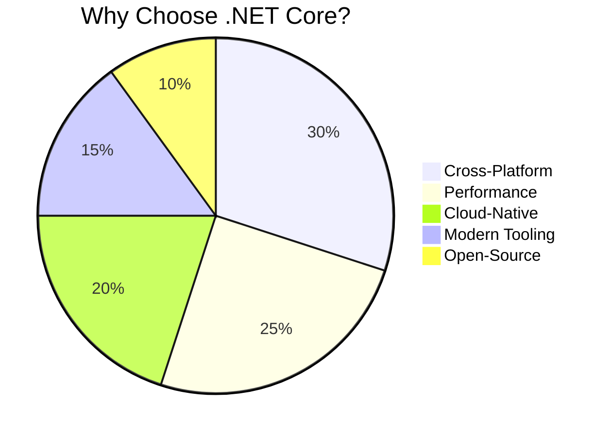

- **.NET Core** is **faster, cross-platform, and cloud-ready**.  
- Best for **modern apps, microservices, and scalable systems**.  
- **.NET Framework** remains relevant for **legacy Windows apps**.  


# **5. Dependency Injection (DI) in .NET Core**

## **What is Dependency Injection?**  
**Dependency Injection (DI)** is a design pattern that allows a class to receive its dependencies (objects it needs) **from an external source** instead of creating them itself. It promotes **loose coupling**, **testability**, and **maintainability** by separating the creation of objects from their usage.

### **Analogy** 🍕  
Imagine a pizza chef who doesn’t grow vegetables or make cheese. Instead, ingredients (dependencies) are delivered (injected) by suppliers. This lets the chef focus on cooking (business logic) without worrying about sourcing ingredients.

---

## **Why is DI Useful in .NET Core?** 🚀  
| **Benefit**                | **Explanation**                                                                 | **Example**                                                                 |
|-----------------------------|---------------------------------------------------------------------------------|-----------------------------------------------------------------------------|
| **Loose Coupling**          | Classes depend on abstractions (interfaces), not concrete implementations.      | Change a database provider (SQL Server → PostgreSQL) without modifying code. |
| **Testability**             | Inject mock dependencies for unit testing.                                       | Test a payment service without calling a real payment gateway.              |
| **Reusability**             | Share services across multiple components.                                       | Use the same logging service in controllers, middleware, and background jobs. |
| **Simplified Maintenance**  | Centralized dependency management in the DI container.                           | Update service configurations in one place (`Startup.cs`).                  |

---

## **How DI Works in .NET Core** 🔄  
.NET Core provides a **built-in DI container** that manages the creation and injection of dependencies.  

### **Step-by-Step Flow**  
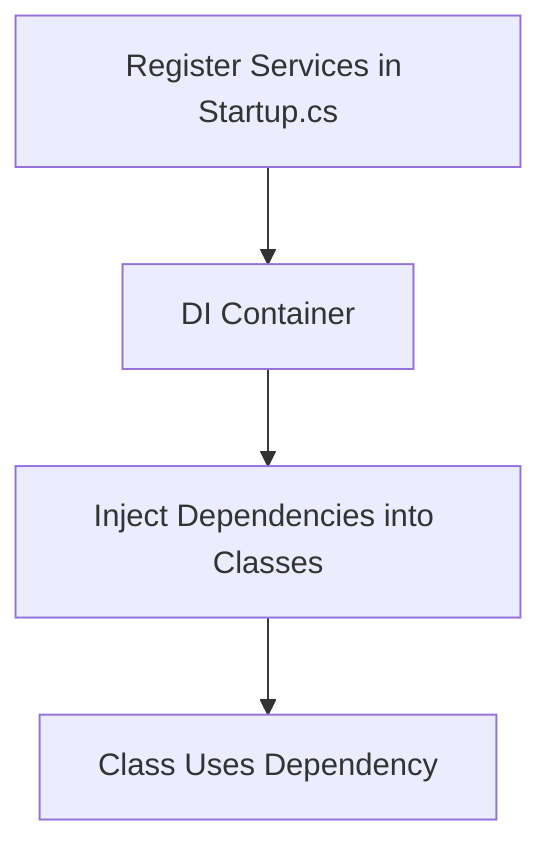

1. **Register Services** in `Startup.ConfigureServices()`.  
2. **Inject Dependencies** via constructors, properties, or methods.  
3. **Use the Dependency** in your code.  

---

## **Service Lifetimes in .NET Core** ⏳  
| **Lifetime**       | **Description**                                                                 | **Use Case**                                |
|---------------------|---------------------------------------------------------------------------------|---------------------------------------------|
| **Singleton**       | One instance for the entire app lifetime.                                       | Configuration manager, logging service.     |
| **Scoped**          | One instance per HTTP request (in web apps).                                    | Database context (e.g., `DbContext`).       |
| **Transient**       | A new instance every time it’s requested.                                       | Lightweight, stateless services (e.g., DTOs). |

---

## **Example: DI in Action** 💻  

### **1. Define an Interface and Service**  
```csharp
public interface IEmailService {
    void SendEmail(string message);
}

public class EmailService : IEmailService {
    public void SendEmail(string message) {
        // Send email logic
    }
}
```

### **2. Register the Service in `Startup.cs`**  
```csharp
public void ConfigureServices(IServiceCollection services) {
    services.AddScoped<IEmailService, EmailService>(); // Scoped lifetime
}
```

### **3. Inject the Service into a Controller**  
```csharp
public class UserController : Controller {
    private readonly IEmailService _emailService;

    // Constructor injection
    public UserController(IEmailService emailService) {
        _emailService = emailService;
    }

    public IActionResult NotifyUser() {
        _emailService.SendEmail("Your order is confirmed!");
        return View();
    }
}
```

---

## **Real-World Use Case** 🌍  
**Scenario**: Building an e-commerce app where multiple components (cart, payment, notifications) need a logging service.  
- **Without DI**: Each component creates its own logger, leading to code duplication.  
- **With DI**: Inject a single `ILogger` service into all components.  
```csharp
services.AddSingleton<ILogger, FileLogger>(); // One logger instance app-wide
```

---

## **Key Takeaways** 🎯  
1. **DI decouples classes** by outsourcing dependency creation.  
2. **.NET Core’s DI container** simplifies dependency management.  
3. **Choose lifetimes wisely** (Singleton vs. Scoped vs. Transient).  
4. **DI aligns with SOLID principles**, especially the *Dependency Inversion Principle*.  


```
  ```


# **6. Memory Management in .NET Core**

**.NET Core** uses **automatic memory management** through a **Garbage Collector (GC)** to handle memory allocation and deallocation. This reduces manual memory errors (e.g., leaks) and simplifies development. Let’s break it down:

---

## **Key Concepts** 🔑

### 1. **Garbage Collector (GC)** 🗑️
   - Automatically reclaims memory occupied by unused objects.
   - **How it works**:
     1. **Allocation**: Objects are created on the **heap**.
     2. **Marking**: GC identifies unused objects (no references).
     3. **Collection**: Frees memory from marked objects.
     4. **Compaction**: Rearranges memory to reduce fragmentation.

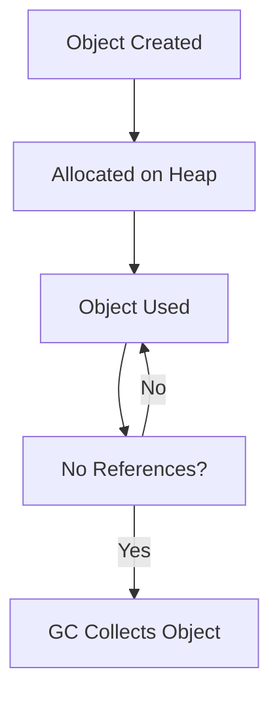

---

### 2. **Stack vs. Heap** 📚
| **Stack**                          | **Heap**                              |
|------------------------------------|---------------------------------------|
| Stores **value types** (e.g., `int`, `struct`). | Stores **reference types** (e.g., `class`, `string`). |
| Memory managed automatically (LIFO). | Memory managed by GC.                |
| Faster access.                     | Slower access.                        |

---

### 3. **Generations (Gen 0, Gen 1, Gen 2)** 🔄
   - **Gen 0**: Short-lived objects (e.g., temp variables). Collected frequently.
   - **Gen 1**: Survives Gen 0 collection. Collected less often.
   - **Gen 2**: Long-lived objects (e.g., static data). Collected rarely.
   - **Large Object Heap (LOH)**: For large objects (>85KB). Collected with Gen 2.


---

## **How .NET Core Optimizes Memory** 🚀

### 1. **Automatic Garbage Collection**  
   - **Example**:  
     ```csharp
     void ProcessData() {
         var data = new List<int>(); // Allocated on the heap
         // ... use data ...
     } // 'data' becomes unreachable → GC collects it
     ```

### 2. **Finalizers and `IDisposable`** 🛠️  
   - Use `IDisposable` to manually release unmanaged resources (e.g., files, DB connections).  
   - **Example**:  
     ```csharp
     public class FileLogger : IDisposable {
         private StreamWriter _writer;
         public FileLogger(string path) => _writer = new StreamWriter(path);
         public void Dispose() => _writer.Dispose(); // Manually release resource
     }

     // Usage:
     using (var logger = new FileLogger("log.txt")) { // Auto-disposed
         logger.Write("Hello");
     }
     ```

### 3. **GC Modes** ⚙️  
   - **Workstation GC**: Optimized for UI apps (low latency).  
   - **Server GC**: Optimized for throughput (used in cloud apps).  

---

## **Real-World Use Cases** 🌍

### 1. **Web Server Handling Requests** 🌐  
   - **Scenario**: An ASP.NET Core app processes HTTP requests.  
   - **GC Action**: Collects short-lived request objects (Gen 0) quickly to free memory.

### 2. **High-Performance Data Processing** 📊  
   - **Scenario**: A financial app processes large datasets.  
   - **Optimization**: Use `ArrayPool<T>` to reuse arrays and reduce GC pressure.  
     ```csharp
     var pool = ArrayPool<int>.Shared;
     int[] buffer = pool.Rent(1000); // Reusable buffer
     // ... process ...
     pool.Return(buffer); // Return to pool
     ```

### 3. **Game Development** 🎮  
   - **Scenario**: A Unity game uses .NET Core for backend logic.  
   - **Optimization**: Avoid frequent Gen 2 collections by reusing object pools.

---

## **Best Practices** ✅

1. **Avoid Memory Leaks**:  
   - Unsubscribe events.  
   - Dispose `IDisposable` objects (e.g., `DbContext`, `FileStream`).  

2. **Minimize Large Object Allocations**:  
   - Use `Span<T>` or `Memory<T>` for buffer management.  

3. **Monitor Memory**:  
   - Use tools like **dotMemory** or **Visual Studio Diagnostic Tools**.  

---

## **.NET Core vs. .NET Framework Memory Management** ⚖️

| **Feature**               | **.NET Core**                                | **.NET Framework**                     |
|---------------------------|----------------------------------------------|----------------------------------------|
| **GC Modes**              | Server/Workstation + Background GC           | Workstation GC only                    |
| **LOH Improvements**      | Configurable LOH size in .NET 6+             | No LOH tuning                          |
| **Performance**           | Optimized for cloud and containers           | Less optimized for modern workloads    |

---

# **Summary** 📝

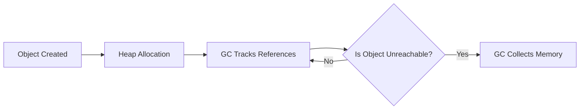

- **.NET Core** automates memory management via the **Garbage Collector**.  
- **Generations (0/1/2)** optimize collection frequency.  
- Use `IDisposable` for unmanaged resources and **object pooling** for performance.  
- **Server GC** and **LOH tuning** make .NET Core ideal for cloud-native apps.  

```
```
# **7. What is Kestrel, and Why is it Used in .NET Core?**

## **What is Kestrel?** 🧩
**Kestrel** is a **cross-platform, lightweight, and high-performance web server** built specifically for **.NET Core** applications. It is the default web server that hosts and runs ASP.NET Core apps, handling HTTP requests directly. Think of Kestrel as the "engine" that powers your app’s ability to communicate over the web.

---

## **Why Use Kestrel in .NET Core?** 🔑

| **Feature**                | **Explanation**                                                                 | **Example**                                                                 |
|-----------------------------|---------------------------------------------------------------------------------|-----------------------------------------------------------------------------|
| **Cross-Platform**          | Runs on Windows, Linux, and macOS.                                              | Host a .NET Core API on a Linux server without IIS.                         |
| **High Performance**        | Optimized for speed and scalability (handles 1M+ requests/sec).                 | Ideal for microservices or APIs requiring low latency.                      |
| **Self-Contained**          | No dependency on external servers like IIS.                                     | Deploy a standalone app to a Docker container.                              |
| **Async I/O Support**       | Uses async programming for non-blocking request handling.                       | Serve thousands of concurrent users efficiently.                            |
| **Integration with ASP.NET**| Seamlessly works with ASP.NET Core middleware and pipelines.                    | Add authentication, logging, or routing via middleware.                     |

---

## **Kestrel Architecture** 🏗️

```mermaid
flowchart LR
    A[Client] --> B[Reverse Proxy (Nginx/IIS/Apache)]
    B --> C[Kestrel]
    C --> D[ASP.NET Core App]
    D --> C --> B --> A
```

1. **Client** sends an HTTP request.
2. **Reverse Proxy** (optional) handles SSL, caching, or load balancing.
3. **Kestrel** processes the request via the ASP.NET Core middleware pipeline.
4. **ASP.NET Core App** generates the response, sent back through Kestrel.

---

## **Kestrel vs. IIS** ⚖️

| **Aspect**            | **Kestrel**                                      | **IIS**                                       |
|-----------------------|-------------------------------------------------|-----------------------------------------------|
| **Platform Support**  | Cross-platform (Windows, Linux, macOS)          | Windows-only                                  |
| **Performance**       | Faster, optimized for async I/O                 | Slower due to overhead                        |
| **Features**          | Lightweight (no built-in GUI or advanced tools) | Rich features (GUI, app pools, modules)       |
| **Deployment**        | Self-contained, no external server needed       | Requires IIS installation and configuration   |

---

## **Real-World Use Cases** 🌍

### 1. **Self-Hosted API in Docker** 🐳
   ```csharp
   // Program.cs
   var builder = WebApplication.CreateBuilder(args);
   builder.WebHost.UseKestrel();
   var app = builder.Build();
   app.MapGet("/", () => "Hello from Kestrel in Docker!");
   app.Run();
   ```
   - **Deploy**: Run the app in a Linux Docker container with no external web server.

### 2. **Microservices Architecture** 🔗
   - Use Kestrel to host multiple microservices, each running on its own port.
   - **Example**:
     ```bash
     dotnet run --urls "http://localhost:5001;http://localhost:5002"
     ```

### 3. **Reverse Proxy Setup** 🔄
   - **Scenario**: Secure a Kestrel-hosted app with Nginx (SSL termination + load balancing).
   - **Nginx Config**:
     ```nginx
     server {
         listen 80;
         location / {
             proxy_pass http://localhost:5000;
             proxy_http_version 1.1;
         }
     }
     ```

---

## **Best Practices** ✅

1. **Use a Reverse Proxy in Production**  
   - **Why?** Kestrel isn’t designed for direct internet exposure (security, SSL, static files).  
   - **Options**: Nginx, Apache, IIS, or cloud load balancers (AWS ALB, Azure Front Door).

2. **Configure Timeouts and Limits**  
   - Adjust Kestrel settings for request timeouts and connection limits:
     ```csharp
     builder.WebHost.ConfigureKestrel(serverOptions => {
         serverOptions.Limits.MaxConcurrentConnections = 100;
         serverOptions.Limits.KeepAliveTimeout = TimeSpan.FromMinutes(5);
     });
     ```

3. **Monitor Performance**  
   - Use tools like **Application Insights** or **Prometheus** to track request throughput and latency.

---

# **Summary** 📝


- **Kestrel** is the **default, cross-platform web server** for .NET Core apps.  
- **Key Benefits**: High performance, async I/O, and self-contained deployment.  
- **Use Cases**: Microservices, Docker containers, and APIs behind reverse proxies.  
- **Best Practice**: Pair Kestrel with a reverse proxy (Nginx, IIS) for security and scalability.  
 
```
