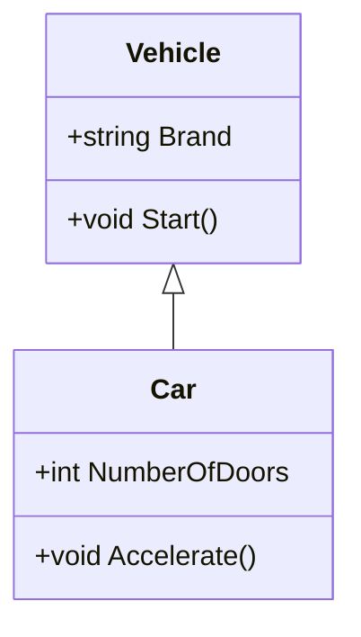
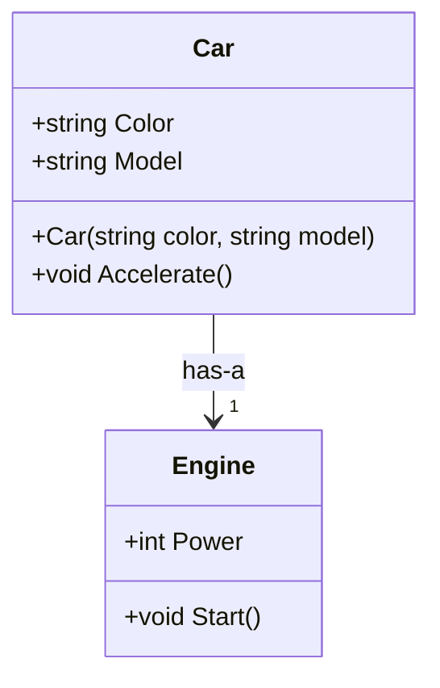
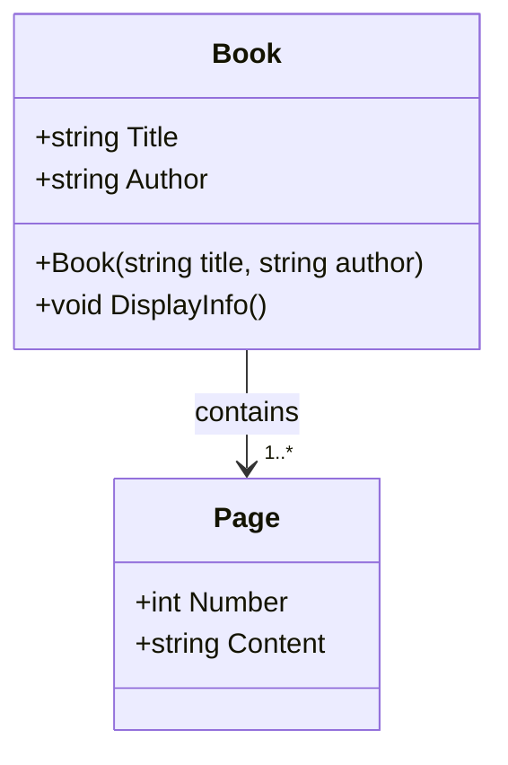
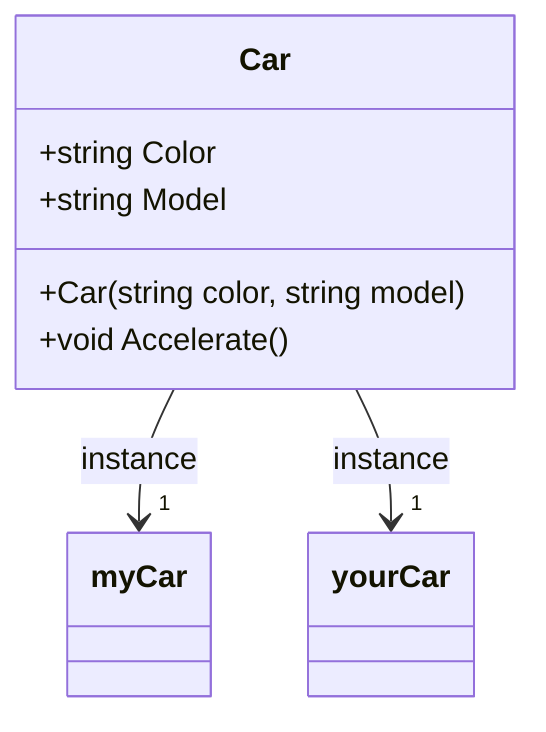
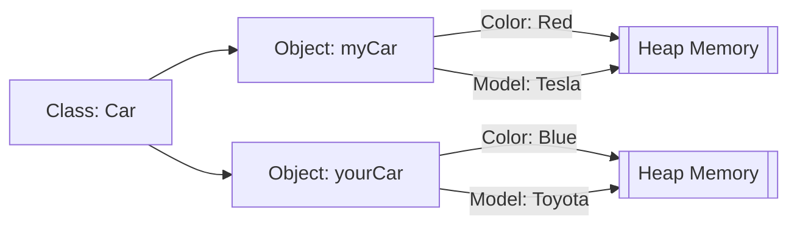
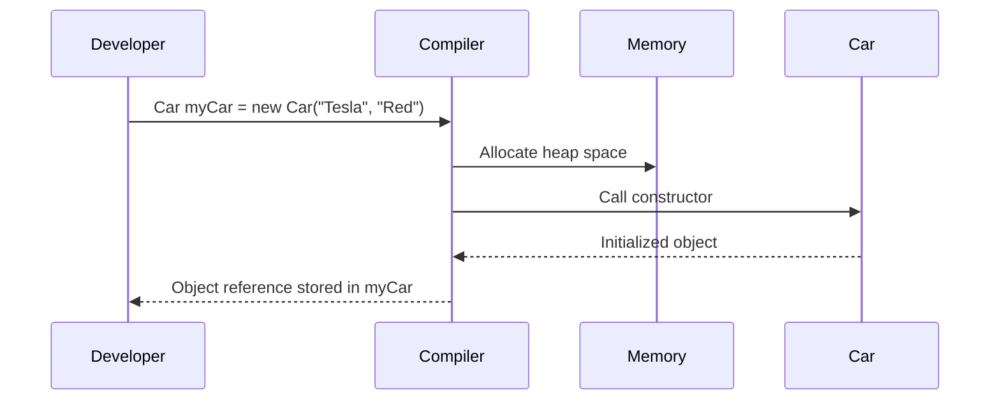

<details>
  <summary><strong>What is a Class?</strong></summary>
 

# **What is a Class?**
A **class** is a **blueprint** or **template** that defines the structure and behavior of objects. It encapsulates **data (properties)** and **functions (methods)** that operate on the data. Objects are **instances** of a class, created at runtime.

### Real-World Analogy
Think of a **class** as the architectural blueprint of a house. The blueprint defines:
- **Properties**: Number of rooms, color, size.
- **Methods**: Open the door, turn on lights.

The actual houses built using this blueprint are **objects** (instances).

---

## 🖥️ **Code Example (C#)**
```csharp
public class Car
{
    // Properties (data)
    public string Color { get; set; }
    public string Model { get; set; }

    // Constructor (initializes data)
    public Car(string color, string model)
    {
        Color = color;
        Model = model;
    }

    // Method (behavior)
    public void Accelerate()
    {
        Console.WriteLine($"{Model} is accelerating!");
    }
}
```

### Creating Objects (Instances)
```csharp
Car myCar = new Car("Red", "Tesla Model S");
Car yourCar = new Car("Blue", "Toyota Camry");

myCar.Accelerate(); // Output: "Tesla Model S is accelerating!"
yourCar.Accelerate(); // Output: "Toyota Camry is accelerating!"
```

---

## 📊 **Key Components of a Class**
| Component       | Description                                                                 | Example                          |
|-----------------|-----------------------------------------------------------------------------|----------------------------------|
| **Properties**  | Variables that hold the state/data of the object.                           | `Color`, `Model`                 |
| **Methods**     | Functions that define actions the object can perform.                       | `Accelerate()`                   |
| **Constructor** | Special method to initialize object properties when created.                | `Car(string color, string model)`|
| **Access Modifiers** | Control visibility (e.g., `public`, `private`).                         | `public string Color { get; set; }` |

---

## 🧩 **OOP Principles Supported by Classes**

### 1. **Encapsulation**
- Bundling data and methods into a single unit.
- Example: Hide `engineTemperature` as `private` and expose via a method `GetTemperature()`.

### 2. **Inheritance**
- Creating a new class from an existing class.


### 3. **Polymorphism**
- Methods can behave differently based on the object.
```csharp
public class ElectricCar : Car
{
    public override void Accelerate()
    {
        Console.WriteLine("Accelerating using electric power!");
    }
}
```

### 4. **Abstraction**
- Simplify complexity by hiding unnecessary details.
- Example: An abstract `Shape` class with an abstract `Draw()` method.

---

## 🆚 **Class vs. Object**
| **Class**                          | **Object**                          |
|------------------------------------|-------------------------------------|
| Template/blueprint.                | Instance of a class.                |
| Defined once.                      | Created multiple times.             |
| Exists in code.                    | Exists in memory at runtime.        |
| Example: `Car` blueprint.          | Example: `myCar`, `yourCar`.        |

---

## 🆚 **Class vs. Struct (C#)**
| Feature                | **Class**                           | **Struct**                         |
|------------------------|-------------------------------------|------------------------------------|
| **Type**               | Reference type (heap).              | Value type (stack).                |
| **Nullability**        | Can be `null`.                      | Cannot be `null` (unless nullable).|
| **Inheritance**        | Supports inheritance.               | No inheritance.                    |
| **Default Constructor**| Can have a custom default.          | Always has a default constructor.  |
| **Use Case**           | Complex objects (e.g., `User`).     | Small data (e.g., `Point`).        |

---

## 📍 **Real-Time Use Cases**
1. **Web Development**: A `User` class with `Email`, `Password`, and `Login()` method.
2. **Game Development**: A `Character` class with `Health`, `Attack()`, and `Move()`.
3. **E-Commerce**: A `Product` class with `Price`, `Stock`, and `AddToCart()`.

---

## 🖼️ **Pictorial Diagram**


---

## ❓ **Common Interview Questions**
1. **Q**: Can a class exist without an object?  
   **A**: Yes (e.g., static classes), but objects cannot exist without a class.

2. **Q**: What is a static class?  
   **A**: A class that cannot be instantiated and contains only static members (e.g., `Math`).

3. **Q**: How does a class achieve abstraction?  
   **A**: By using abstract classes/interfaces to hide implementation details.

---

## 🛠️ **Best Practices**
- Follow **SOLID principles**.
- Use `private` fields and expose via `public` properties/methods (encapsulation).
- Prefer composition over inheritance where possible.
 </details>


 <details>
  <summary><strong>What is an object in C#?</strong></summary>
(Due to technical issues, the search service is temporarily unavailable.)

# Explanation of an Object in C# (Object-Oriented Programming)

## 🧩 **What is an Object?**
An **object** is a **runtime instance of a class** that holds **data (state)** and can perform **actions (behavior)**. It is created using the `new` keyword and resides in memory during program execution. Objects are the building blocks of OOP.

### Real-World Analogy
If a **class** is a blueprint for a house, an **object** is the actual house built from that blueprint. Each house (object) has:
- **Unique state**: Address, paint color, furniture.
- **Shared behavior**: Open doors, turn on lights (defined in the blueprint/class).

---

## 🖥️ **Code Example (C#)**
```csharp
// Class (Blueprint)
public class Book
{
    // Properties (state)
    public string Title { get; set; }
    public string Author { get; set; }

    // Constructor (initializes state)
    public Book(string title, string author)
    {
        Title = title;
        Author = author;
    }

    // Method (behavior)
    public void DisplayInfo()
    {
        Console.WriteLine($"{Title} by {Author}");
    }
}

// Creating Objects (Instances)
Book book1 = new Book("The Alchemist", "Paulo Coelho");
Book book2 = new Book("1984", "George Orwell");

book1.DisplayInfo(); // Output: "The Alchemist by Paulo Coelho"
book2.DisplayInfo(); // Output: "1984 by George Orwell"
```

---

## 📊 **Key Characteristics of Objects**
| Feature               | Description                                                                 | Example                          |
|-----------------------|-----------------------------------------------------------------------------|----------------------------------|
| **State**             | Values stored in properties/fields.                                         | `Title = "1984"`, `Author = "George Orwell"` |
| **Behavior**          | Actions performed by methods.                                               | `DisplayInfo()`                  |
| **Identity**          | Unique memory address (even if state is identical).                         | `book1` ≠ `book2`                |
| **Lifetime**          | Exists in memory until garbage collected.                                   | Created with `new`, destroyed by GC. |

---

## 🧩 **How Objects Work in Memory**
- Objects are **reference types** stored in the **heap**.
- Variables (e.g., `book1`) hold **references** (memory addresses) to objects.


---

## 🆚 **Class vs. Object**
| **Class**                          | **Object**                          |
|------------------------------------|-------------------------------------|
| Blueprint (template).              | Instance (real entity).             |
| Defined at compile time.           | Created at runtime.                 |
| No memory allocation.              | Memory allocated in the heap.       |
| Example: `Book` class.             | Example: `book1`, `book2`.          |

---

## 🧠 **Object Lifecycle in C#**
1. **Creation**:  
   `Book book = new Book(...);`
2. **Usage**:  
   Access properties/methods: `book.Title`, `book.DisplayInfo()`.
3. **Destruction**:  
   Garbage Collector (GC) automatically reclaims memory when the object is no longer referenced.

---

## 🛠️ **Real-Time Use Cases**
1. **Web Development**:  
   `HttpContext` object in ASP.NET Core holds request/response data.
2. **E-Commerce**:  
   `ShoppingCart` object stores items and calculates totals.
3. **Database**:  
   `DbContext` in Entity Framework represents a database session.

---

## 📍 **Common Interview Questions**
1. **Q**: What happens when you assign one object to another?  
   **A**: Both variables point to the **same memory location** (reference copy, not a new object).  
   ```csharp
   Book book3 = book1; // book3 and book1 reference THE SAME object
   book3.Title = "New Title"; // Changes book1.Title too
   ```

2. **Q**: What is a `struct` vs. a `class`?  
   **A**:  
   | Feature         | **Class**                          | **Struct**                        |
   |-----------------|------------------------------------|-----------------------------------|
   | **Type**        | Reference type (heap).             | Value type (stack).               |
   | **Nullability** | Can be `null`.                     | Cannot be `null` (unless nullable).|
   | **Example**     | `StringBuilder`, `HttpClient`.     | `DateTime`, `int`.                |

3. **Q**: What is the `this` keyword?  
   **A**: Refers to the **current object instance** (e.g., `this.Title = title;`).

---

## 🖼️ **Pictorial Representation**


- **Objects**: `book1`, `book2`, `page1`, `page2`.

---

## 🛑 **Best Practices**
1. **Encapsulation**: Keep fields `private` and expose via properties/methods.  
   ```csharp
   private string _password;
   public string Password { get { return _password; } set { _password = Encrypt(value); } }
   ```

2. **Object Initialization**: Use constructors to enforce valid states.  
   ```csharp
   // BAD: Object in invalid state
   Book book = new Book();
   book.Title = "Some Title";

   // GOOD: Enforce required fields
   public Book(string title, string author) { ... }
   ```

3. **Memory Management**: Avoid unnecessary object creation in loops. Use `IDisposable` for unmanaged resources.

---

## 🌟 **Key Takeaways**
- Objects are **instances** of classes.
- They combine **data** and **behavior**.
- Memory is managed by the **Garbage Collector**.
- Use objects to model real-world entities (e.g., `User`, `Order`, `Product`).
   </details>


<details>
  <summary><strong>What is the difference between a class and an object?</strong></summary>
(Due to technical issues, the search service is temporarily unavailable.)

# Difference Between a Class and an Object in C#

## 🧱 **Overview**
| **Aspect**       | **Class**                          | **Object**                        |
|-------------------|------------------------------------|-----------------------------------|
| **Definition**    | Blueprint/template for objects.    | Instance of a class.              |
| **Memory**        | No memory allocated at definition. | Memory allocated in the heap.     |
| **Creation**      | Defined once in code.              | Created multiple times using `new`.|
| **Purpose**       | Defines structure and behavior.    | Represents real-world data/actions.|
| **Example**       | `Car` (template).                  | `myCar`, `yourCar` (instances).   |

---

## 🏗️ **Class: The Blueprint**
A **class** is a logical template that defines:
- **Properties/Fields**: Variables to store data (e.g., `Color`, `Model`).
- **Methods**: Functions to perform actions (e.g., `Accelerate()`).
- **Constructors**: Initialize objects (e.g., `Car(string color, string model)`).

### Example Class (C#)
```csharp
public class Car 
{
    // Properties
    public string Color { get; set; }
    public string Model { get; set; }

    // Constructor
    public Car(string color, string model)
    {
        Color = color;
        Model = model;
    }

    // Method
    public void Accelerate() 
    {
        Console.WriteLine($"{Model} is accelerating!");
    }
}
```

---

## 🚗 **Object: The Instance**
An **object** is a concrete instance of a class, created at runtime. It:
- **Holds Data**: Properties have actual values (e.g., `Color = "Red"`).
- **Performs Actions**: Methods execute behavior (e.g., `Accelerate()`).

### Example Objects (C#)
```csharp
Car myCar = new Car("Red", "Tesla Model S");
Car yourCar = new Car("Blue", "Toyota Camry");

myCar.Accelerate(); // Output: "Tesla Model S is accelerating!"
yourCar.Accelerate(); // Output: "Toyota Camry is accelerating!"
```

---

## 🖼️ **Pictorial Representation**


---

## 💡 **Real-World Analogy**
- **Class**: A cookie cutter 🍪 (defines shape/size).
- **Object**: Actual cookies 🍪 made using the cutter (each has unique color/toppings).

---

## 🧠 **Key Differences**
### 1. **Memory Allocation**
- **Class**: No memory allocated until an object is created.
- **Object**: Memory allocated in the heap when instantiated.

### 2. **Lifetime**
- **Class**: Exists in code forever.
- **Object**: Lives in memory until garbage-collected.

### 3. **Usage**
- **Class**: Defines rules for objects.
- **Object**: Stores data and performs actions.

---

## 🛠️ **Real-Time Use Cases**
1. **E-Commerce**:  
   - **Class**: `Product` (defines `Id`, `Price`, `Name`).  
   - **Object**: `product1` (Id=101, Price=49.99, Name="Laptop").

2. **Banking**:  
   - **Class**: `Account` (defines `Balance`, `Withdraw()`).  
   - **Object**: `johnsAccount` (Balance=5000, Withdraw(1000)).

3. **Gaming**:  
   - **Class**: `Player` (defines `Health`, `Attack()`).  
   - **Object**: `player1` (Health=100, Attack()).

---

## 🧩 **Memory Diagram**


---

## ❓ **Common Interview Questions**
1. **Q**: Can a class exist without objects?  
   **A**: Yes (e.g., static classes like `Math`), but objects **cannot** exist without a class.

2. **Q**: What happens if two objects have the same property values?  
   **A**: They are still **different objects** (different memory addresses).  
   ```csharp
   Car car1 = new Car("Red", "Tesla");
   Car car2 = new Car("Red", "Tesla");
   // car1 != car2 (different references)
   ```

3. **Q**: Can a class inherit from an object?  
   **A**: No! A class inherits from another **class**, not an object.

---

## 🛑 **Best Practices**
1. **Encapsulation**: Keep fields `private` and expose via properties/methods.  
   ```csharp
   public class BankAccount 
   {
       private double _balance;
       public double Balance => _balance; // Read-only property
   }
   ```

2. **Constructors**: Enforce valid object states during creation.  
   ```csharp
   // BAD: Object can be invalid
   Car car = new Car();
   car.Model = "Tesla";

   // GOOD: Force required fields
   public Car(string model) { Model = model; }
   ```

3. **Avoid God Classes**: Split large classes into smaller, focused ones (e.g., `Car`, `Engine`, `Wheel`).

---

## 🌟 **Key Takeaways**
- **Class**: Recipe 🧾 (defines ingredients and steps).
- **Object**: Dish 🍲 (created using the recipe).
- Objects bring classes to life by storing data and performing actions!
</details>

<details>
  <summary><strong>How do you create an object of a class in C#?</strong></summary>

# Creating an Object of a Class in C#

## 🏗️ **Steps to Create an Object**
To create an object of a class in C#, follow these steps:
1. **Define the Class**: Declare the class with properties and methods.
2. **Instantiate with `new`**: Use the `new` keyword to allocate memory.
3. **Call the Constructor**: Initialize the object using a constructor.

---

## 🖥️ **Code Example**
### 1. Define a Class
```csharp
public class Car
{
    // Properties
    public string Model { get; set; }
    public string Color { get; set; }

    // Constructor
    public Car(string model, string color)
    {
        Model = model;
        Color = color;
    }

    // Method
    public void Drive()
    {
        Console.WriteLine($"{Model} is driving!");
    }
}
```

### 2. Create an Object
```csharp
Car myCar = new Car("Tesla Model S", "Red");
myCar.Drive(); // Output: "Tesla Model S is driving!"
```

---

## 🧩 **Key Concepts**

### 1. **The `new` Keyword**
- Allocates memory in the **heap** for the object.
- Calls the **constructor** to initialize the object.

### 2. **Constructors**
- Special methods with the **same name as the class**.
- Initialize the object’s state.
- If no constructor is defined, C# provides a **default parameterless constructor**.

#### Example: Default vs. Parameterized Constructor
| **Constructor Type** | **Example**                              |
|-----------------------|------------------------------------------|
| **Default**           | `Car car = new Car();`                   |
| **Parameterized**     | `Car car = new Car("Tesla", "Red");`     |

---

## 🛠️ **Object Initialization Styles**
### 1. **Constructor Initialization**
```csharp
Car myCar = new Car("Tesla Model S", "Red");
```

### 2. **Object Initializer (Set Properties After Creation)**
```csharp
Car myCar = new Car()
{
    Model = "Tesla Model S",
    Color = "Red"
};
```

### 3. **Implicit Typing with `var`**
```csharp
var myCar = new Car("Tesla Model S", "Red");
```

---

## 🖼️ **Memory Allocation Diagram**
```mermaid
flowchart LR
    A[myCar Variable] --> B[[Heap Memory]]
    B --> |Model: Tesla Model S| B
    B --> |Color: Red| B
    B --> |Drive()| B
```

---

## 🆚 **Class vs. Object Creation**
| **Class**                          | **Object Creation**                     |
|------------------------------------|-----------------------------------------|
| Template for objects.              | Actual instance in memory.              |
| No memory allocated.               | Memory allocated via `new`.             |
| Example: `Car` (blueprint).        | Example: `myCar`, `yourCar` (instances).|

---

## 📍 **Real-Time Use Cases**
1. **User Authentication**:  
   ```csharp
   User user = new User("john_doe", "password123");
   user.Login();
   ```
2. **E-Commerce Order**:  
   ```csharp
   Order order = new Order(101, DateTime.Now);
   order.AddProduct("Laptop");
   ```
3. **Game Character**:  
   ```csharp
   Player player = new Player("Warrior", 100);
   player.Attack();
   ```

---

## 🧠 **Common Interview Questions**
1. **Q**: What happens if you don’t use `new`?  
   **A**: The object is **not created**, and the variable remains `null`.  
   ```csharp
   Car myCar; // myCar is null
   // myCar.Drive(); --> NullReferenceException!
   ```

2. **Q**: Can you create an object without a constructor?  
   **A**: No! Even if you don’t define one, the **default constructor** is used.  
   ```csharp
   public class Car { } // Default constructor exists
   Car car = new Car(); // Valid
   ```

3. **Q**: What is the `default` keyword in object creation?  
   **A**: Initializes objects to default values (e.g., `null` for classes).  
   ```csharp
   Car car = default; // car = null
   ```

---

## 🛑 **Best Practices**
1. **Use Constructors for Validation**:  
   ```csharp
   public class BankAccount
   {
       public BankAccount(double initialBalance)
       {
           if (initialBalance < 0) throw new ArgumentException("Balance cannot be negative!");
       }
   }
   ```

2. **Avoid Public Fields**: Use properties with `private` setters.  
   ```csharp
   public class User
   {
       public string Username { get; private set; }
   }
   ```

3. **Prefer Object Initializers for Readability**:  
   ```csharp
   var user = new User()
   {
       Username = "john_doe",
       Email = "john@example.com"
   };
   ```

---

## 🧩 **Pictorial Workflow**


---

## 🌟 **Key Takeaways**
1. Objects are created using `new` + constructor.
2. Constructors initialize the object’s state.
3. Memory is allocated in the **heap**.
4. Use object initializers for flexible property assignment.
</details>
